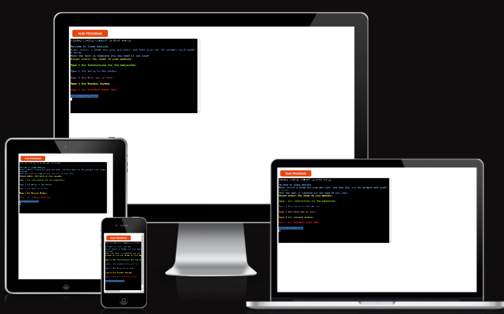
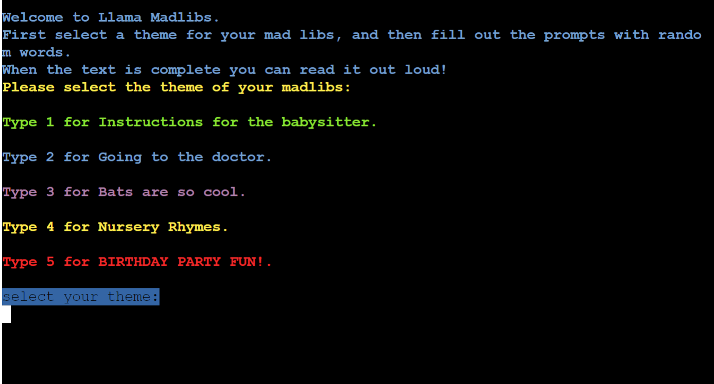
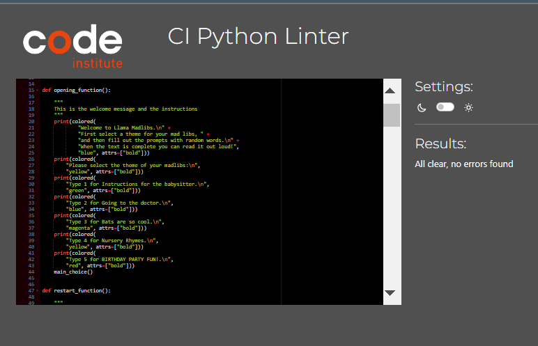

#  Llama Mad Libs

This is a simple app to play Mad Libs with. It welcomes the user with a straightforward message on how to play and then presents the user with several themes to choose from. It is intended for children as a simple pastime.

## User Goals

 - To have a simple word game that you can play with kids. It isn't too distracting and does help with basic grammar.
 - To get amused with a silly text for a short period of time.

## Features 

### Existing Features

- __Welcome message__

  - This section shows what  themes the user can choose from and what he needs to input to access them.

- __Themes__

 - Currently, there are three options available to play with: 
   - Instructions for the babysitter
   - Going to the doctor
   - Bats are so cool.
   - Nursery Rhymes.
   - BIRTHDAY PARTY FUN!

- __Different Madlibs__

  - After being asked for a few different words, the user will be presented with a filled-out Mad Libs to read out loud.

## Design diagram 

- __Project Requirements__

 - Python application using libraries/API and deployed to a cloud-based platform.
 - The code itself, just like the game, it is very simple:
   - A function to present the user with a choice of themes. 
   - A separate function for each Madlibs. These consist of a group of inputs to fill out a template literal.
   - A boolean if statement to protect the input from non-alphabetical characters.

### Things to improve:

- At the moment,  every madlib is a separate function. So grouping them  and the word selections into an array might help to make the code less verbose.
- The code is fairly extensive for what it does, and many elements are redundant or repetitive. This could have been done in a more nuanced way, but my original idea was beyond my ability.  Due to this, I have decided to write this project in the most simple and wide way possible to familiarize myself with what everything does and how it works, and to help me learn factoring more naturally and from the ground up.

## Technologies and libraries used

__Main languages__

- __Python__
-  __HTML:__ Provided in the Code Institute template
-  __CSS:__ Provided in the Code Institute template
-  __JavaScript:__ Provided in the Code Institute template

__Python libraries and api used__

-  Termcolor

## Testing 

- Testing has been conducted continuously during the development process. Manual testing has been conducted by the author.

### Validator Testing 

**TEST** | **ACTION** | **EXPECTATION** | **RESULT** 
----------|----------|----------|----------
Theme select	| Tested all options from 1 to 5 and not numericals	| To play the game when 1 to 5 and to print an error and loop back when not | Works as expected
Word input	| input alphabetical symbols, numbers, spaces and empty | For it to accept alphabetical and spaces but to print an error and loop back otherwise. | Works as expected
Filled out text | Playng the game | To print a filled out template literal | Works as expected
Replay prompt | Type "yes" and anything else | On "yes" game will restart, on any other input the game will end | Works as expected

  - No errors were found. The code has been tested by using PEP8 CI Python Linter https://pep8ci.herokuapp.com/#

## Development and Deployment
 
- The development environment used for this project was GitPod. To track the development stage and handle version control regular commits and pushes to GitHub has been conducted. The GitPod environment was created using a template provided by Code Institute.

The live version of the project is deployed using Heroku(https://heroku.com)

This is how this project was deployed using Heroku:

To prepare for deployment on Heroku a requirements.txt needs to be created in the same folder as the .py file in GitPod. This file needs to contain a list of all libraries the project needs to run as a Heroku App.

Then follow these steps:

Login to Heroku (Create an account if necessary)
Click on New in the Heroku dashboard and select ”Create new app”
Write a name for the app and choose your region and click ”Create App”
In the settings tab for the new application I created two Config vars.
One is named CREDS and contains the credentials key for Google Drive API
One is name PORT and has the value of 8000
Two buildpack scripts were added: Python and Nodejs (in that order)
Heroku CLI was used to deploy the project. The following steps were taken in the terminal in GitPod

Deploying your app to heroku

Login to heroku and enter your details.
command: heroku login -i
Get your app name from heroku.
command: heroku apps
Set the heroku remote. (Replace app_name with your actual app name)
command: heroku git:remote -a app_name
Add, commit and push to github
command: git add . && git commit -m "Deploy to Heroku via CLI"
Push to both github and heroku
command: git push origin main
command: git push heroku main
After those steps were taken the application was deployed at the following link: https://llamamadlibs-9afa07ffadcc.herokuapp.com/

## Credits 

Resources and tutorials used for developing this project:
- Templates and ideas taken from [Wordlibs](https://www.thewordfinder.com/wordlibs/)
-  Inspiration came from this childrens book [Llama Llama Mad Libs Junior: World's Greatest Word Game](https://www.amazon.com/Llama-Mad-Libs-Junior/dp/1524790346)
- Colors used from the library: [termcolor ](https://pypi.org/project/termcolor/#description)

Massive thanks to, [Lauren-Nicole Popich](https://www.linkedin.com/in/lauren-nicole-popich-1ab87539/) my Code Institute mentor, for her guidance.
